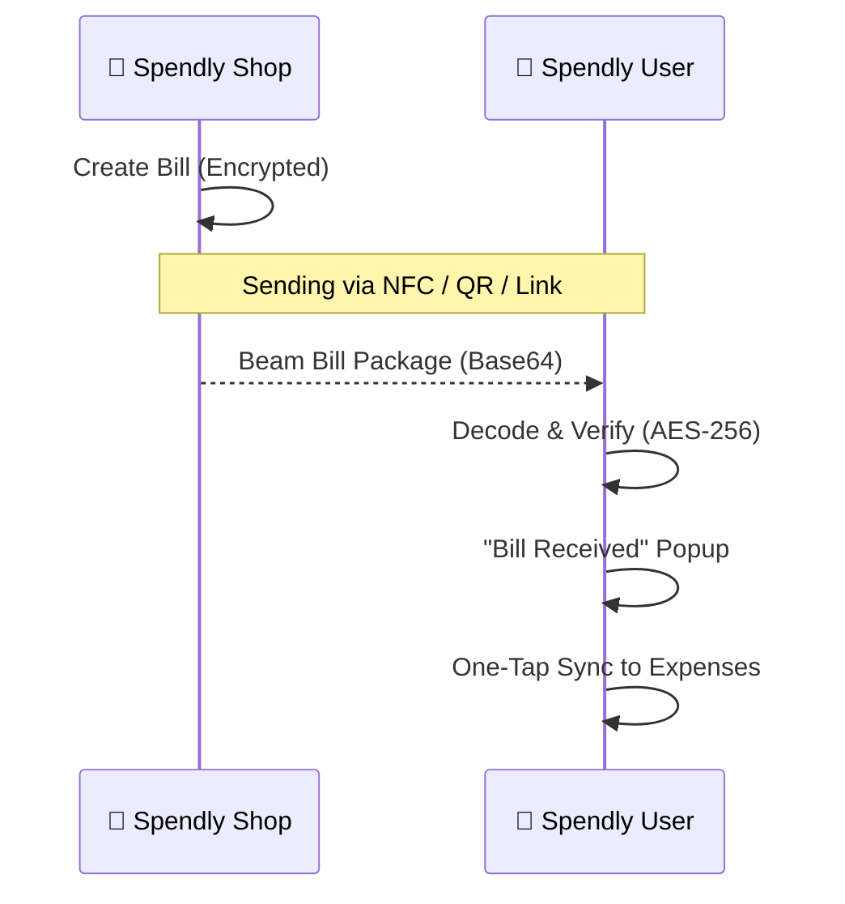

#  Spendly Ecosystem

<p align="center">
  
</p>

<p align="center">
  
  
  
</p>

---

## ✨ Overview

Spendly is a dual-app ecosystem reimagining how businesses and customers interact. Built with **Privacy-First** architecture, it allows merchants to create secure bills and customers to receive them instantly via **NFC**, **QR**, or **Deep Links**—all while keeping data 100% private and encrypted at rest.

### 🏪 Spendly Shop (Merchant App)
*A high-speed billing and CRM powerhouse for the modern business owner.*
- ⚡ **30-Second Billing**: Create complex invoices with GST and discounts in seconds.
- 📡 **Multi-Channel Sending**: Beam bills via **Web NFC**, dynamic QR codes, or WhatsApp.
- 💳 **Credit Recovery**: Track customer dues with automated payment reminders.
- 📊 **Business Intelligence**: Real-time sales reports, top items, and customer analytics.

### 👤 Spendly User (Customer App)
*The ultimate private expense manager that receives bills automatically.*
- 🛡️ **Zero-Knowledge Sync**: Add expenses instantly by tapping your phone at the shop.
- 💼 **Digital Wallet**: Securely store all your receipts in one encrypted vault.
- 📈 **Smart Analytics**: Deep insights into your spending patterns with a "White Premium" UI.

---

## 🛠️ The Tech Stack

| Core | Database | Styling | Animation |
| :--- | :--- | :--- | :--- |
| **React 18** | **Dexie.js (IndexedDB)** | **Tailwind CSS** | **Framer Motion** |
| **Vite 5** | **AES-256-GCM Crypto** | **Lucide Icons** | **Lottie Flow** |

---

## 🚀 How it Works (The "Beam" Protocol)



---

## 📦 Project Structure

```bash
Spendly/
├── apps/
│   ├── spendly-shop/      # The Merchant/Shop App (Green Theme)
│   └── spendly-user/      # The Consumer/Personal App (Indigo Theme)
├── packages/
│   └── shared/            # Shared design tokens and utilities
└── .github/workflows/     # Automated Cloudflare Deployment
```

---

## 🔧 Installation & Local Setup

1. **Clone the repository**
   ```bash
   git clone https://github.com/PDA-DP-Shop/Spendly.git
   cd Spendly
   ```

2. **Setup Shop App**
   ```bash
   cd apps/spendly-shop
   npm install
   npm run dev
   ```

3. **Setup User App**
   ```bash
   cd apps/spendly-user
   npm install
   npm run dev
   ```

---

## 🌐 Deployment

Both apps are configured for automatic deployment via **GitHub Actions** to **Cloudflare Pages**. 

- **Shop App:** [spendly-shop.pages.dev](https://spendly-shop.pages.dev)
- **User App:** [spendly-24hrs.pages.dev](https://spendly-24hrs.pages.dev)

> [!IMPORTANT]
> To enable CI/CD, ensure `CF_API_TOKEN` and `CF_ACCOUNT` are added to your GitHub Secrets.

---

<p align="center">
  Built with ❤️ by <b>Team Codinity</b> <br/>
  <i>"Privacy is not an option, it's a fundamental right."</i>
</p>

<p align="center">
  
</p>
