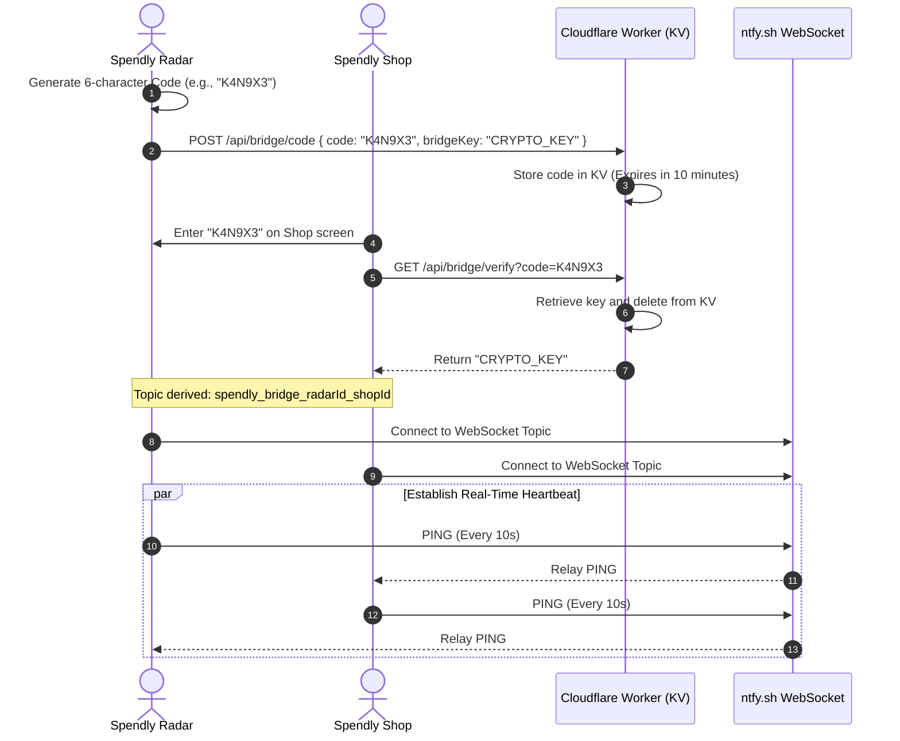
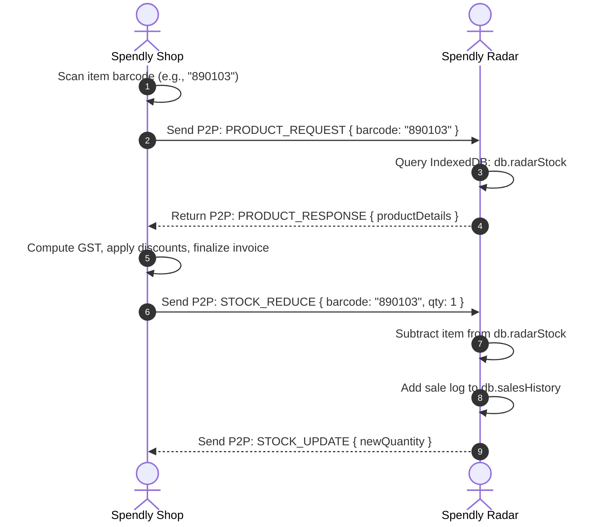
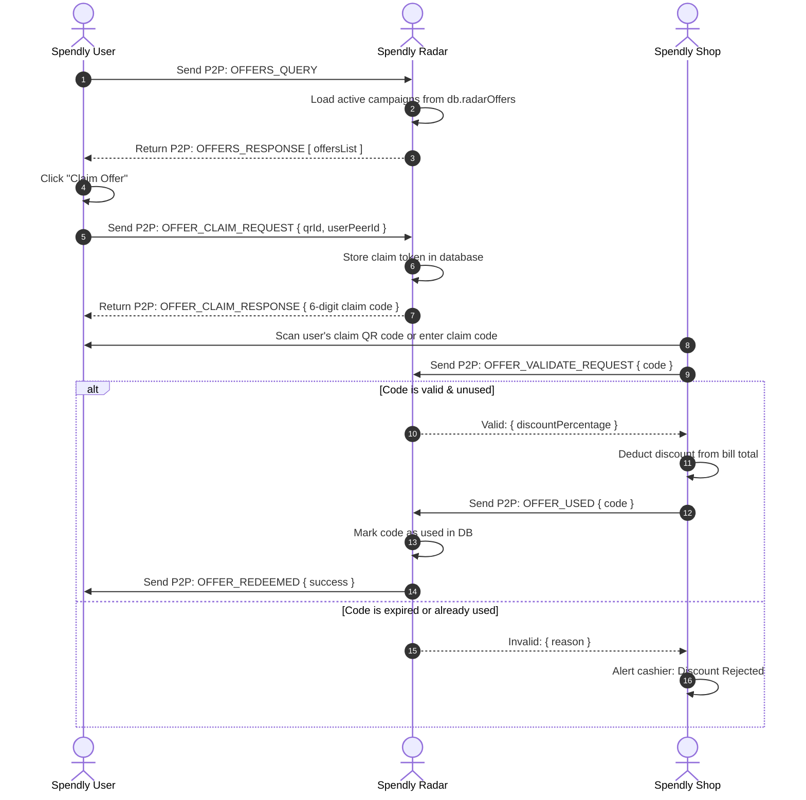
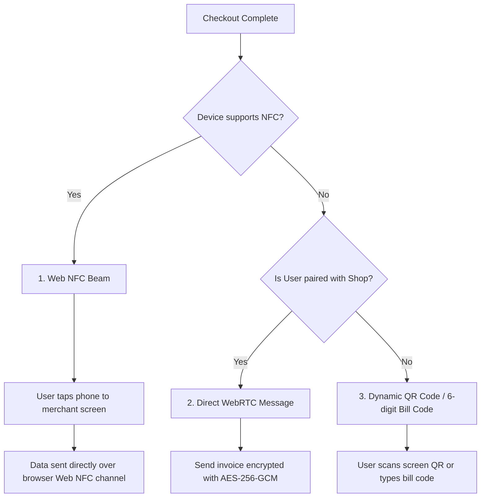
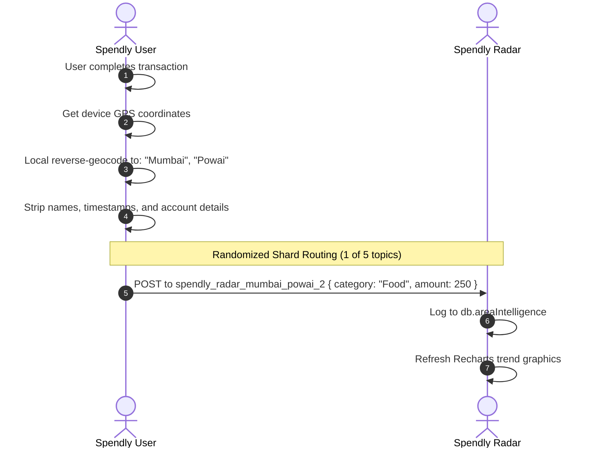

# SPENDLY: A ZERO-KNOWLEDGE, HARDWARE-SECURED P2P BILLING AND EXPENSE ECOSYSTEM
### Semester VII Micro Project Report
**Course:** Bachelor of Technology in Information Technology  
**Developer:** Patel Devansh  
**Academic Session:** 2026-2027  

---

## 🎓 Viva Quick Study Guide (Cheat Sheet)
*If you are asked these questions by your professor/examiner, here is how you answer:*

*   **Q: Where is the database hosted?**
    *   **Answer:** There is **no database server**. All database data is stored locally on the user's/merchant's device using **IndexedDB** (via Dexie.js).
*   **Q: If there is no cloud database, how do the apps talk to each other?**
    *   **Answer:** They communicate directly using **WebRTC (PeerJS)**. If they are open on the same device, they use a same-device **LocalStorage Bridge** to share data instantly with zero latency.
*   **Q: What is the Cloudflare Worker used for?**
    *   **Answer:** The Worker has three small jobs: (1) Temporary 6-digit code pairing database (clears immediately after pairing), (2) Cloud backup of encrypted stock/catalog data (in Cloudflare KV), and (3) PWA update/force-update version checks.
*   **Q: How is security handled without user passwords on a server?**
    *   **Answer:** We use the browser's hardware-backed **WebAuthn API** (Passkeys). This locks the local IndexedDB behind the device's physical secure chip (Secure Enclave) using Touch ID/Face ID.
*   **Q: How do you send analytics without exposing user privacy?**
    *   **Answer:** The User app geolocates locally on-device. It strips all personal names or identifiers and sends only category and amount details ephemerally to nearby **Spendly Radar** devices.

---

## 1. 🎯 Why We Built Spendly (The Motivation)

Modern fintech platforms operate on a centralized model. This introduces several major problems that Spendly solves:

### 1.1 The Privacy Problem
Apps like expense trackers scan your SMS notifications, bank balances, and receipts, sending that data to central cloud databases. This sensitive financial information is often sold to advertisers or exposed in security breaches.  
**Spendly's Solution:** It uses a **Zero-Knowledge Architecture**. The developer has no access to transaction histories; all databases remain inside the user's device.

### 1.2 The Cost Problem
Merchants pay monthly fees for Point-of-Sale (POS) software, catalog hosting, and database upkeep.  
**Spendly's Solution:** By using client-side browser storage and WebRTC, the merchant pays **zero server fees**.

### 1.3 The Internet Dependency Problem
If a store loses internet access, its POS systems can shut down.  
**Spendly's Solution:** Spendly runs offline. When internet is unavailable, apps fall back to same-device local storage bridging or local P2P networks.

---

## 2. 🛠️ What We Use (The Technology Stack)

The ecosystem is split into three main client PWAs (Progressive Web Apps) and a serverless relay utility:

```
                  ┌─────────────────────────────────┐
                  │          SPENDLY USER           │
                  │   (Consumer Expense Tracker)    │
                  └────────┬───────────────┬────────┘
                           │               │
      LocalStorage Bridge  │               │ WebRTC Direct Connection
      (Same-device sync)   │               │ (Cross-device data beam)
                           │               │
                  ┌────────┴───────────────┴────────┐
                  │          SPENDLY SHOP           │
                  │     (Merchant POS Billing)      │
                  └────────┬───────────────┬────────┘
                           │               │
      Stock Sync & Updates │               │ Offers Discovery & Claims
                           │               │
                  ┌────────┴───────────────┴────────┐
                  │          SPENDLY RADAR          │
                  │   (Local Stock & Offers Hub)    │
                  └─────────────────────────────────┘
```

### 2.1 Storage Layer: IndexedDB (Dexie.js)
*   **What it is:** A local, transactional object-oriented database built into the browser.
*   **Why we use it:** Unlike `localStorage` (which is limited to 5MB and blocks the main execution thread), IndexedDB can store gigabytes of structured data asynchronously. We wrap it in **Dexie.js** for simple querying, schema version upgrades, and relations.

### 2.2 Direct Network Layer: WebRTC (PeerJS)
*   **What it is:** Web Real-Time Communication allows browsers to establish direct, peer-to-peer data streams without going through an intermediate application server.
*   **Why we use it:** We use **PeerJS** to coordinate the connections, allowing the Shop to pull inventory details directly from the Radar and send invoices straight to the User's device.

### 2.3 Pairing Network Layer: ntfy.sh WebSocket Bridge
*   **What it is:** A free, public pub/sub signaling channel.
*   **Why we use it:** Standard WebRTC requires exchanging "session descriptions" (SDPs) between devices. We use `ntfy.sh` as a lightweight bridge topic (`spendly_bridge_${Id1}_${Id2}`) to exchange these connection handshake packets instantly.

### 2.4 Serverless Layer: Cloudflare Worker & KV
*   **What it is:** A globally distributed, serverless code framework.
*   **Why we use it:** We use a Cloudflare Worker (`spendly-worker`) to temporarily store 6-digit pairing keys, track application updates, and store encrypted copies of merchant stock data.

### 2.5 Security Layer: WebAuthn (Passkeys)
*   **What it is:** A secure browser authentication API using asymmetric cryptography.
*   **Why we use it:** It allows users to unlock their offline database by verifying their identity through Face ID, Fingerprint scanner, or device PIN, interacting directly with the device's hardware enclave.

---

## 3. ⚙️ How It Works (Step-by-Step Logic Flows)

### 3.1 Establishing the P2P Pairing Connection
When a merchant wants to connect Spendly Shop to Spendly Radar, they use a secure 6-digit key exchange.



### 3.2 Inventory Queries & Real-Time Sales Synchronization
When a customer buys an item in the Shop, the system queries the Radar for details and updates stock counts automatically.



### 3.3 Discovering & Redeeming Offers
Shoppers can discover active merchant discount campaigns and redeem them securely using client-side verification.



### 3.4 Transferring Invoices (The Billing Beam)
To transfer invoices from the store register to the shopper's wallet, Spendly uses three fallback methods:



### 3.5 Privacy-Preserving Analytics (Area Intelligence)
Spendly compiles area-level spending trends (like "Average grocery spend in Area X is ₹450") without exposing individual identities.



---

## 4. 🌟 Key Innovations & Local Features

### 4.1 Same-Device LocalStorage Bridge
For testing and single-device users, if you open both Spendly User and Spendly Shop in different tabs on the same browser, they don't use network bandwidth. They communicate using a custom listener bound to browser **StorageEvents**:
```javascript
export const sendLocalMessage = (type, data) => {
  localStorage.setItem('spendly_bridge_msg', JSON.stringify({
    type,
    data,
    timestamp: Date.now(),
    source: myPeerId
  }));
};
```

### 4.2 India-Centric Cash Wallet
Unlike standard digital expense managers, Spendly supports physical cash management by tracking individual note denominations. Users can view and adjust counts for ₹500, ₹200, ₹100, and ₹50 notes, with the wallet updating overall balances automatically.

### 4.3 On-Device SMS Alert Parser
Instead of requesting backend SMS permissions, Spendly parses transaction alerts copied to the clipboard. The regex-based parser extracts transaction details locally:
```javascript
const smsText = "Amt debited: Rs.1,500.00 at STAR BAZAR using card xx4321.";
const parseSMS = (text) => {
  const amt = text.match(/(?:Rs\.?|INR|₹)\s*([\d,]+(?:\.\d{2})?)/i)?.[1];
  const isDebit = /(debited|spent|withdrawn)/i.test(text);
  const merchant = text.match(/(?:at|to|in)\s*([a-zA-Z0-9\s\-]+)/i)?.[1];
  return { amount: amt, isDebit, merchant };
};
```

### 4.4 Shagun Gifts Tracker
A unique feature designed to track traditional Indian cash gifts given during weddings and festivals. It helps families maintain records of who gifted what amount, keeping track of social reciprocity balances.

---

## 5. 📦 Database Schema Details (Dexie.js)

Spendly structures its local database schemas inside client-side IndexedDB files. Here is the relational setup:

### 5.1 Spendly User Database
*   **`expenses`**: `++id, category, amount, date, shopName, isSoftDeleted`
*   **`wallets`**: `++id, name, type, balance`
*   **`emiAlerts`**: `++id, title, amount, dueDate, isPaid`
*   **`shagunRegistry`**: `++id, personName, eventName, amount, type` (Given / Received)

### 5.2 Spendly Shop Database
*   **`sales`**: `++id, billNumber, totalAmount, discount, tax, timestamp`
*   **`inventory`**: `++id, barcode, name, price, quantity, unit`

### 5.3 Spendly Radar Database
*   **`radarStock`**: `++id, barcode, name, price, quantity`
*   **`radarOffers`**: `++id, title, discountPercent, expiresAt, category`
*   **`areaIntelligence`**: `++id, category, amount, city, area, timestamp`

---

## 6. 🌐 Technical Specifications Directory

For team alignment and academic evaluation, here are the granular programming details of how Spendly functions under the hood.

### 6.1 🖥️ Frontend Specifications
*   **Framework**: React (v18/19) Single Page Application (SPA) architecture.
*   **Build Tool / Compiler**: **Vite** for fast hot module replacement (HMR) and optimized build bundles.
*   **State Management**: **Zustand** for high-performance React stores, avoiding excessive hook context re-renders.
*   **Navigation & Routing**: **React Router DOM** (v6/v7) for component rendering and screen transitions.
*   **Animations**: **Framer Motion** and **GSAP** for fluid, shadowless "Flat Premium Aura" transitions.
*   **Styling**: **Tailwind CSS** with **PostCSS** using custom border parameters instead of drop shadows.

### 6.2 ⚙️ Backend Specifications (Serverless & Broker)
*   **Server Architecture**: **Zero-Instance Hosting** (No permanently active cloud servers, reducing maintenance to $0).
*   **Edge Functions**: **Cloudflare Workers** (V8 runtime engine) serving serverless REST API endpoints for matchmaking and updates.
*   **Signaling Broker**: Public pub/sub channels on **ntfy.sh** WebSocket server streams (`wss://ntfy.sh/topic/ws`) to exchange WebRTC session headers.
*   **Static Page Hosting**: **Cloudflare Pages** for global distribution and low latency.

### 6.3 💾 Storage Specifications & Physical Locations
*   **Local Storage Engine**: Browser-native **IndexedDB** wrapped in **Dexie.js** for handling transactional records.
*   **Sandbox Security**: Origin isolation prevents `spendly-shop` from accessing `spendly-user` tables.
*   **Disk Storage Paths**:
    *   **macOS (Chrome)**: `~/Library/Application Support/Google/Chrome/Default/IndexedDB/`
    *   **Windows (Chrome)**: `%LOCALAPPDATA%\Google\Chrome\User Data\Default\IndexedDB\`
    *   **Android (Chrome)**: `/data/data/com.android.chrome/app_chrome/Default/IndexedDB/`
*   **Cloud KV Namespaces**: **Cloudflare Workers KV** (`SPENDLY_STOCK` and `SPENDLY_DATA`) for storing pairing codes and encrypted stock backups.

### 6.4 🔤 Application Languages & Formats
*   **Spendly User (Consumer App)**: Built using **JavaScript (React / ES6+)**, **HTML5**, and **CSS3 (Tailwind CSS)**.
*   **Spendly Shop (Merchant POS App)**: Built using **JavaScript (React / ES6+)**, **HTML5**, and **CSS3 (Tailwind CSS)**.
*   **Spendly Radar (Local Catalog App)**: Built using **JavaScript (React / ES6+)**, **HTML5**, and **CSS3 (Tailwind CSS)**.
*   **Spendly Worker (Matchmaker API)**: Built using **JavaScript (V8 ES Modules)** running on serverless V8 runtimes.
*   **Data Transport Schema**: Uses **JSON (JavaScript Object Notation)** for WebRTC message framing and IndexedDB configuration backups.
*   **Biometric Key Payload**: Standard W3C **WebAuthn Cryptographic Objects** generated by local secure enclave processors.

---

## 7. 🌐 Progressive Web App (PWA) Lifecycle

Spendly is deployed on Cloudflare Pages and configured as a progressive web app to run offline.

### 7.1 Service Worker Caching Strategies
We use Workbox inside `vite-plugin-pwa` with a custom service worker (`sw.js`):
*   **Precaching**: Static assets like icons, fonts, and script bundles are cached during installation.
*   **Cache-Control Headers**: Custom header rule configurations (`public/_headers`) ensure that service worker scripts (`sw.js`) and manifests (`manifest.json`) are checked for updates instead of being cached indefinitely.

### 7.2 Emergency Force-Update Channel
If a critical database bug is discovered, the Cloudflare Worker hosts an emergency endpoint (`/app-version`). Once per day, client apps query this endpoint:
```javascript
const res = await fetch('https://spendly-worker.devanshpatel12022005.workers.dev/app-version');
const data = await res.json();
if (data.forceUpdate) {
  // Lock app interface, show update dialog, and hide "Later" button
  triggerPWAUpdate();
}
```

---

## 8. Conclusion & Future Scope

Spendly proves that financial apps can be built without high cloud hosting fees or centralized databases. By combining IndexedDB, WebRTC, and hardware Passkeys, Spendly provides a secure, private, and offline-first finance ecosystem.

### Future Objectives
1.  **Web Bluetooth Integration**: Allow devices to pair using Bluetooth Low Energy when local Wi-Fi or mobile data are completely unavailable.
2.  **On-Device AI Assistant**: Integrate lightweight local models (WebGPU-accelerated) to analyze spending trends on-device, preserving user privacy.
